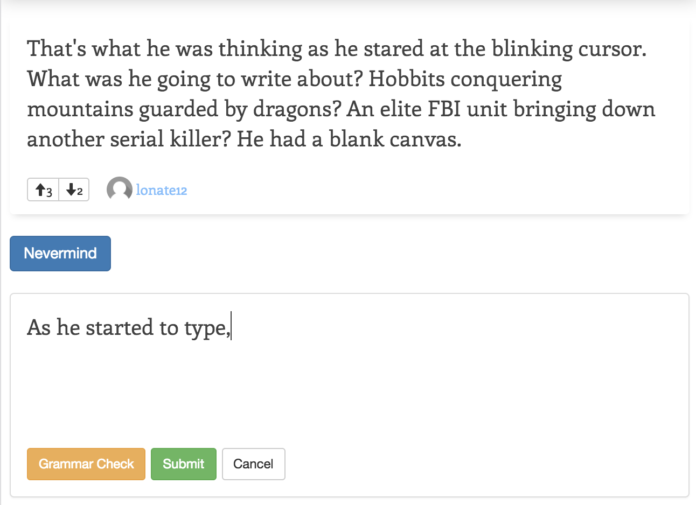

# Spark-A-Story
#### An Iron Yard Final Project

Spark-A-Story is open storytelling platform where users can start stories or contribute to already existing stories. 

## Feature Highlights
### Grammar Checker

This feature utilitizes a 3rd party API ([LanguageTool.org](https:/languagetool.org)) to analyize text input in users story segment entries.

### Collaborate on stories with others

Whether you are starting a new story or adding a segment conribution, you can easily add or edit segments with story editor with a click of a button. 

### Upvote/Downvote segments

Users can indicate their fondness of a story sefment by clicking on the down/up vote buttons.

## Features Include:

### Full CRUD functionality:

* User sign up/login
* Create and update accont information
* Upload a profile picture and update information
* Manage stories and contributions by creating, editing and removing them
* Upvote/Downvote story segments

##Technologies and libraries used to power this app:

##### HTML5
* [HTML5 Spec](https://www.w3.org/TR/html5/)

##### CSS3
* [Bootstrap](http://getbootstrap.com/)

##### Javscript
* [Backbone.js](http://backbonejs.org/)
* [Underscore.js](http://underscorejs.org/)
* [React.js](https://facebook.github.io/react/)
* [LanguageTool.org](https://languagetool.org) (3rd Party API)
* [TinyMCE](https://www.tinymce.com) (LanguageTool Flavored)
* [Parse Server](https://parseplatform.github.io) (REST API)
* [Heroku](http://heroku.com) (DB Hosting)
* [GitHub Pages](https://pages.github.com)

## Shoutouts

I'd like to send a special thanks to my instructor Dan Dietz and the rest of the Iron Yard crew for an amazing 12 week journey! I've learned a ton and I definitely wouldnt've made it this far this fast. 

Keep on hacking!